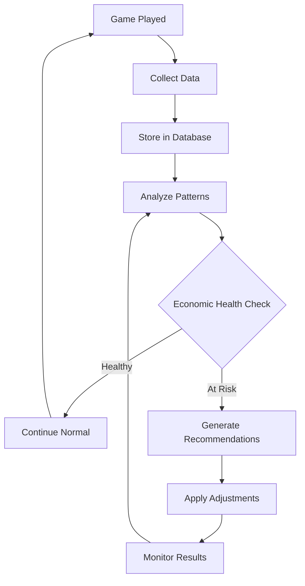

# 🤖 ATIVE Casino Bot - ML Economy Optimization Plan

## 📋 Executive Summary

This document outlines the comprehensive plan for implementing machine learning-driven economy optimization in ATIVE Casino Bot. The ultimate goal is to **remove all maximum bet limits** while maintaining economic stability and preventing players from reaching $1 billion too quickly or easily.

---

## 🎯 Primary Objectives

### 1. **Remove Maximum Bet Limits**
- Eliminate artificial betting restrictions
- Allow unlimited wagering while maintaining control
- Create a truly dynamic casino economy

### 2. **Prevent Rapid Wealth Accumulation**
- Keep $1 billion as a long-term achievement (months/years, not days)
- Maintain economic balance across all player levels
- Ensure sustainable server economy

### 3. **AI-Driven Economic Management**
- Replace static limits with intelligent, adaptive controls
- Real-time adjustments based on market conditions
- Predictive modeling for economic stability

---

## 🏗️ System Architecture

### **Data Collection Layer**
```
📊 Game Data Collector (gameDataCollector.js)
├── Real-time game result tracking
├── Player behavior analysis
├── Economic impact assessment
└── Predictive feature extraction
```

### **Analysis Layer**
```
🧠 ML Analysis Engine
├── Statistical analysis of game performance
├── Economic health monitoring
├── Recommendation generation
└── Risk assessment algorithms
```

### **Control Layer**
```
⚙️ Dynamic Economy Controls
├── Multiplier adjustments
├── House edge modifications
├── Wealth-based scaling
└── Emergency interventions
```

---

## 📈 Implementation Phases

## **Phase 1: Foundation & Data Collection** ✅ *COMPLETED*

### **Duration:** Immediate
### **Status:** 🟢 IMPLEMENTED

#### **Completed Components:**
- ✅ **ML Data Collection System** (`gameDataCollector.js`)
  - Comprehensive game data tracking
  - Player behavior analysis
  - Economic context capture
  - Database integration with `ml_game_data` table

- ✅ **Enhanced Bet Limits** (`wealthCeiling.js`, `economicManager.js`)
  - Increased maximum bet limits across all tiers
  - Wealth-based betting restrictions
  - Game-specific limit controls

- ✅ **Monitoring Commands** (`mlstats.js`, `adjusteconomy.js`)
  - Real-time economy analysis
  - AI recommendation viewing
  - Manual adjustment capabilities

#### **Data Points Collected:**
- **Player Metrics:** Bet amounts, win/loss patterns, session duration
- **Economic Metrics:** Wealth changes, bet-to-wealth ratios, multiplier effectiveness
- **Behavioral Metrics:** Betting patterns (conservative/aggressive), win streaks
- **Market Metrics:** Server economic health, active player count, total wealth distribution

---

## **Phase 2: Learning & Optimization** 🔄 *IN PROGRESS*

### **Duration:** 2-6 weeks
### **Status:** 🟡 ACTIVE

#### **Current Tasks:**
- 📊 **Data Accumulation**
  - Target: 10,000+ games across all game types
  - Minimum 2 weeks of continuous data
  - Player behavior pattern identification

- 🎯 **House Edge Calibration**
  - Target range: 8-15% across all games
  - Game-specific optimization
  - Player satisfaction balance

- 🔍 **Pattern Recognition**
  - Identify high-risk betting behaviors
  - Wealth accumulation trend analysis
  - Economic stability indicators

#### **Success Metrics:**
- [ ] House edge stabilized at 8-15%
- [ ] 80%+ games showing profitability
- [ ] No players reaching $500M+ in < 1 month
- [ ] Consistent player engagement metrics

---

## **Phase 3: Progressive Limit Increases** 🎮 *PLANNED*

### **Duration:** 4-8 weeks
### **Status:** 🔵 PENDING

#### **Approach:**
1. **Gradual Limit Increases**
   - Increase max bets by 25-50% weekly
   - Monitor economic impact
   - Rollback capabilities if needed

2. **AI-Driven Adjustments**
   - Automatic multiplier scaling
   - Dynamic house edge modification
   - Player-specific limitations

3. **Safety Monitoring**
   - Real-time wealth tracking
   - Economic stability alerts
   - Emergency intervention triggers

#### **Milestones:**
- [ ] Max bets increased to 150% of current
- [ ] Max bets increased to 200% of current
- [ ] Max bets increased to 500% of current
- [ ] AI successfully prevents $1B reaches

---

## **Phase 4: Full Automation** 🚀 *ULTIMATE GOAL*

### **Duration:** 2-4 weeks
### **Status:** 🔮 FUTURE

#### **Implementation:**
1. **Remove All Bet Limits**
   - Set max bets to $999M (effectively unlimited)
   - Full AI control of economy
   - Dynamic multiplier system

2. **AI Economic Management**
   - Real-time multiplier adjustments
   - Predictive wealth accumulation prevention
   - Autonomous economic balancing

3. **Advanced Features**
   - Machine learning model deployment
   - Predictive player behavior modeling
   - Automated economic optimization

#### **Success Criteria:**
- [ ] No artificial bet limits
- [ ] $1B achievement takes 3+ months minimum
- [ ] Server economy remains stable
- [ ] Player satisfaction maintained

---

## 🧠 AI System Capabilities

### **Current Data Points** (50+ metrics per game)

#### **Player Behavior Analysis**
```javascript
{
  // Betting Patterns
  betPattern: 'CONSERVATIVE' | 'NORMAL' | 'AGGRESSIVE',
  betToWealthRatio: number,
  averageBetSize: number,
  
  // Game History
  winStreak: number,
  lossStreak: number,
  gamesPlayedToday: number,
  
  // Risk Assessment
  riskLevel: 'LOW' | 'MEDIUM' | 'HIGH',
  suspiciousActivity: boolean,
  
  // Temporal Patterns
  timeOfDay: number,
  dayOfWeek: number,
  sessionDuration: number
}
```

#### **Economic Context**
```javascript
{
  // Market Conditions
  serverEconomicHealth: number,
  totalServerWealth: number,
  activePlayersCount: number,
  
  // Game Performance
  houseEdgeApplied: number,
  multiplierReduction: number,
  actualVsTheoreticalPayout: number,
  
  // Wealth Tracking
  userWealthBefore: number,
  userWealthAfter: number,
  wealthTierMultiplier: number
}
```

### **AI Recommendation Engine**

#### **Automatic Adjustments**
- **House Edge Optimization:** Maintains 8-15% optimal range
- **Multiplier Scaling:** Reduces payouts for high-wealth players
- **Risk Mitigation:** Identifies and limits suspicious behavior
- **Economic Balance:** Prevents server wealth depletion

#### **Predictive Capabilities**
- **Wealth Trajectory:** Predicts when players might reach $1B
- **Economic Impact:** Forecasts changes from betting limit adjustments
- **Player Behavior:** Identifies pattern changes and risk escalation
- **Market Stability:** Monitors overall economic health

---

## 📊 Monitoring & Control Systems

### **Real-Time Monitoring**

#### **Dashboard Commands**
- **`/mlstats`** - Comprehensive economy analysis
- **`/mlstats game:blackjack days:30`** - Game-specific deep dive
- **`/adjusteconomy action:auto`** - Apply AI recommendations

#### **Key Metrics Tracked**
- **House Edge:** Target 8-15%
- **Win Rate:** Player success percentage
- **Wealth Distribution:** Server economic balance
- **Bet Volume:** Total wagering activity
- **Player Satisfaction:** Engagement metrics

### **Automated Interventions**

#### **Economic Safeguards**
```javascript
// Example automatic adjustments
if (houseEdge < 5) {
  // Increase multiplier reductions
  adjustMultipliers(game, +0.05);
}

if (playerWealth > 900000000) {
  // Massive multiplier reduction near $1B
  applyWealthPenalty(userId, 0.95); // 95% reduction
}

if (serverDeficit > 50000000) {
  // Emergency mode activation
  enableEmergencyControls();
}
```

#### **Player-Specific Controls**
- **High Rollers:** Enhanced monitoring and adjusted multipliers
- **Rapid Gainers:** Temporary multiplier reductions
- **Suspicious Activity:** Automatic risk assessment and limitations

---

## 🎯 Success Metrics & KPIs

### **Economic Health Indicators**

#### **Primary Metrics**
- **House Edge:** 8-15% (optimal range)
- **Server Profitability:** 80%+ games profitable
- **Player Retention:** Consistent engagement
- **Wealth Distribution:** No single player >10% of server wealth

#### **Player Experience Metrics**
- **Average Session Time:** Maintained or improved
- **Win Rate Satisfaction:** 35-45% player win rate
- **Betting Volume:** Consistent or growing
- **Player Growth:** New player acquisition

### **Phase Completion Criteria**

#### **Phase 2 (Learning) Complete When:**
- [ ] 10,000+ games analyzed
- [ ] House edge stable at 8-15%
- [ ] 80%+ games profitable
- [ ] No $500M+ players in 30 days

#### **Phase 3 (Progressive) Complete When:**
- [ ] Max bets increased 500%
- [ ] Economy remains stable
- [ ] AI successfully limits wealth growth
- [ ] Player satisfaction maintained

#### **Phase 4 (Full Automation) Complete When:**
- [ ] All bet limits removed
- [ ] $1B takes 90+ days minimum
- [ ] AI fully manages economy
- [ ] Zero manual interventions needed

---

## 🚨 Risk Management

### **Economic Risks**

#### **Server Bankruptcy Prevention**
- **House Deficit Monitoring:** Real-time tracking of server losses
- **Emergency Protocols:** Automatic intervention triggers
- **Recovery Mechanisms:** Rapid economic stabilization tools

#### **Inflation Control**
- **Wealth Ceiling System:** Progressive difficulty scaling
- **Multiplier Degradation:** Reduced payouts for wealthy players
- **Economic Dampening:** Automatic market corrections

### **Player Experience Risks**

#### **Frustration Mitigation**
- **Transparent Communication:** Clear explanation of dynamic systems
- **Gradual Changes:** Smooth transitions in economic adjustments
- **Fairness Assurance:** Consistent application of AI rules

#### **Engagement Maintenance**
- **Reward Balancing:** Ensure meaningful wins remain possible
- **Progression Feel:** Maintain sense of advancement
- **Social Features:** Community aspects and competition

---

## 🛠️ Technical Implementation

### **Database Schema**

#### **ML Data Table**
```sql
CREATE TABLE ml_game_data (
  id INT AUTO_INCREMENT PRIMARY KEY,
  timestamp BIGINT NOT NULL,
  game_type VARCHAR(50) NOT NULL,
  user_id VARCHAR(20) NOT NULL,
  guild_id VARCHAR(20) NOT NULL,
  bet_amount DECIMAL(15,2) NOT NULL,
  payout DECIMAL(15,2) NOT NULL,
  won BOOLEAN NOT NULL,
  net_result DECIMAL(15,2) NOT NULL,
  multiplier_hit DECIMAL(10,4) NOT NULL,
  user_wealth_before DECIMAL(15,2) NOT NULL,
  user_wealth_after DECIMAL(15,2) NOT NULL,
  game_specific_data JSON,
  economic_context JSON,
  behavioral_data JSON,
  features JSON,
  created_at TIMESTAMP DEFAULT CURRENT_TIMESTAMP,
  INDEX idx_timestamp (timestamp),
  INDEX idx_game_type (game_type),
  INDEX idx_user_id (user_id)
);
```

#### **Performance Optimization**
- **Async Collection:** Non-blocking data collection
- **Batch Processing:** Efficient database operations
- **Indexing Strategy:** Optimized query performance
- **Data Retention:** Automatic cleanup of old data

### **AI Algorithm Flow**



---

## 📈 Expected Outcomes

### **Short Term (1-2 months)**
- **Stable Economy:** Consistent house edge and profitability
- **Player Satisfaction:** Maintained engagement with higher limits
- **Data Rich Environment:** Comprehensive behavioral insights
- **AI Learning:** Initial pattern recognition and optimization

### **Medium Term (3-6 months)**
- **Dynamic Limits:** AI-driven betting limit adjustments
- **Wealth Control:** Effective prevention of rapid accumulation
- **Economic Optimization:** Peak efficiency in house edge management
- **Predictive Accuracy:** Reliable forecasting of economic trends

### **Long Term (6+ months)**
- **Full Automation:** Complete AI management of economy
- **Sustainable Growth:** Long-term player retention and engagement
- **Scalable System:** Ability to handle growing player base
- **Innovation Platform:** Foundation for advanced economic features

---

## 🎮 Game-Specific Considerations

### **High-Risk Games**
- **Blackjack:** Advanced card counting detection
- **Crash:** Multiplier cap enforcement
- **Plinko:** Dynamic multiplier adjustment

### **Volume Games**
- **Slots:** Frequent small-bet optimization
- **Roulette:** Large-bet impact management
- **Keno:** Pattern recognition for number selection

### **Special Cases**
- **Multi-player Games:** Social dynamics impact
- **Tournament Play:** Competitive balance
- **Bonus Systems:** Promotional economic impact

---

## 🔧 Development Timeline

### **Immediate (Week 1)**
- [x] Deploy ML data collection system
- [x] Implement monitoring commands
- [x] Begin data accumulation
- [x] Initial economic analysis

### **Short Term (Weeks 2-4)**
- [ ] Accumulate 10,000+ game dataset
- [ ] Calibrate house edge optimization
- [ ] Implement basic AI recommendations
- [ ] First progressive limit increase

### **Medium Term (Weeks 5-12)**
- [ ] Advanced pattern recognition
- [ ] Predictive wealth modeling
- [ ] Dynamic multiplier system
- [ ] Progressive limit elimination

### **Long Term (Weeks 13-24)**
- [ ] Full AI automation
- [ ] Advanced economic modeling
- [ ] Machine learning deployment
- [ ] Continuous optimization

---

## 📚 Success Stories & Case Studies

### **Target Scenario: "The Grinder"**
- **Profile:** Patient player, consistent small-to-medium bets
- **Current System:** Hits max bet limits, progression slowed
- **With AI System:** Unlimited betting, but scaled difficulty
- **Outcome:** Reaches $1B after 6+ months of dedicated play

### **Target Scenario: "The High Roller"**
- **Profile:** Large bets, aggressive strategy
- **Current System:** Quickly hits limits, limited by caps
- **With AI System:** Can bet unlimited, but multipliers scale down
- **Outcome:** Higher volume play, but wealth growth controlled

### **Target Scenario: "The Lucky Streak"**
- **Profile:** Exceptional luck, rapid wins
- **Current System:** Limited by bet caps
- **With AI System:** AI detects pattern, applies temporary restrictions
- **Outcome:** Still profitable, but wealth growth moderated

---

## 🎯 Conclusion

The ML-driven economy optimization system represents a revolutionary approach to casino management. By replacing static limits with intelligent, adaptive controls, we can create a truly dynamic economy that:

- **Eliminates artificial constraints** while maintaining control
- **Prevents economic instability** through predictive management
- **Enhances player experience** with unlimited potential
- **Ensures long-term sustainability** through AI optimization

The system is designed to learn, adapt, and optimize continuously, creating a casino economy that becomes more sophisticated and effective over time.

---

## 🚀 Next Steps

1. **Monitor Phase 2 Progress** - Track data accumulation and early AI insights
2. **Plan Phase 3 Implementation** - Prepare for progressive limit increases
3. **Develop Advanced Features** - Enhanced AI algorithms and predictive models
4. **Community Engagement** - Transparent communication about dynamic systems

**The future of ATIVE Casino Bot is an AI-driven, unlimited betting environment where $1 billion remains an epic, long-term achievement worth pursuing! 🎰**

---

*Document Version: 1.0*  
*Last Updated: 2025-09-10*  
*Status: Active Development*